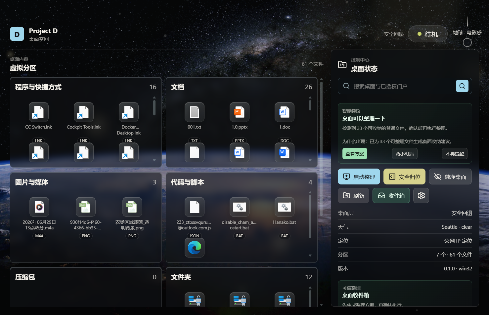
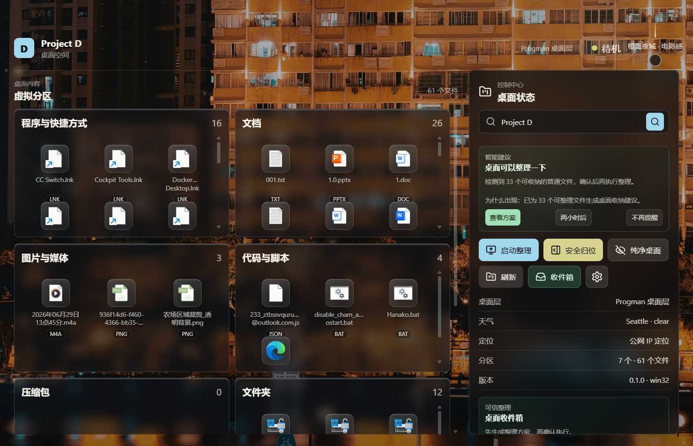
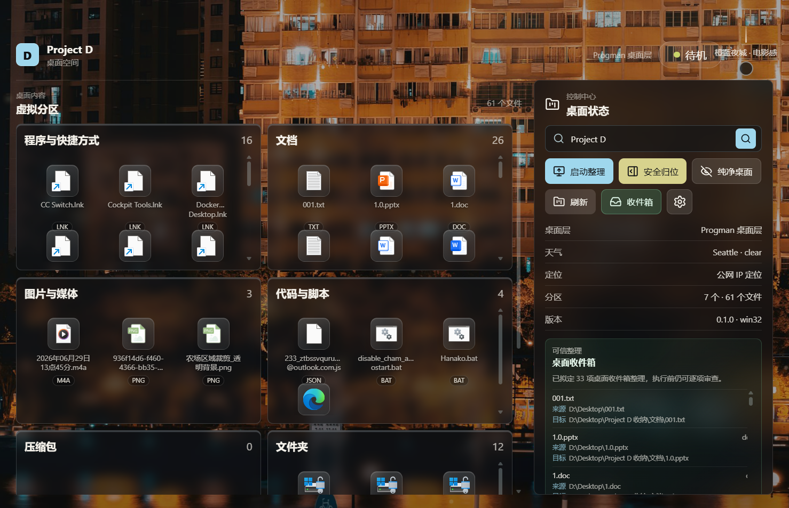
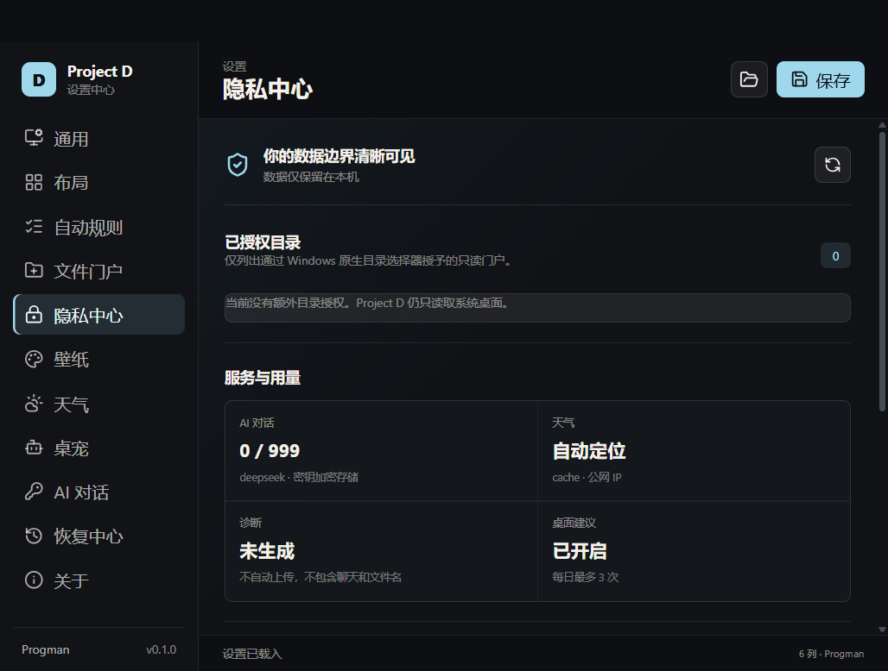
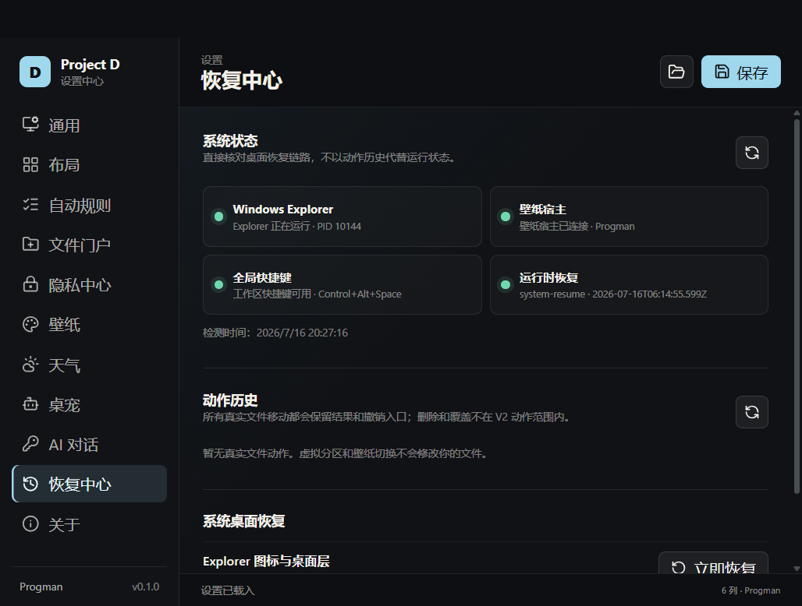
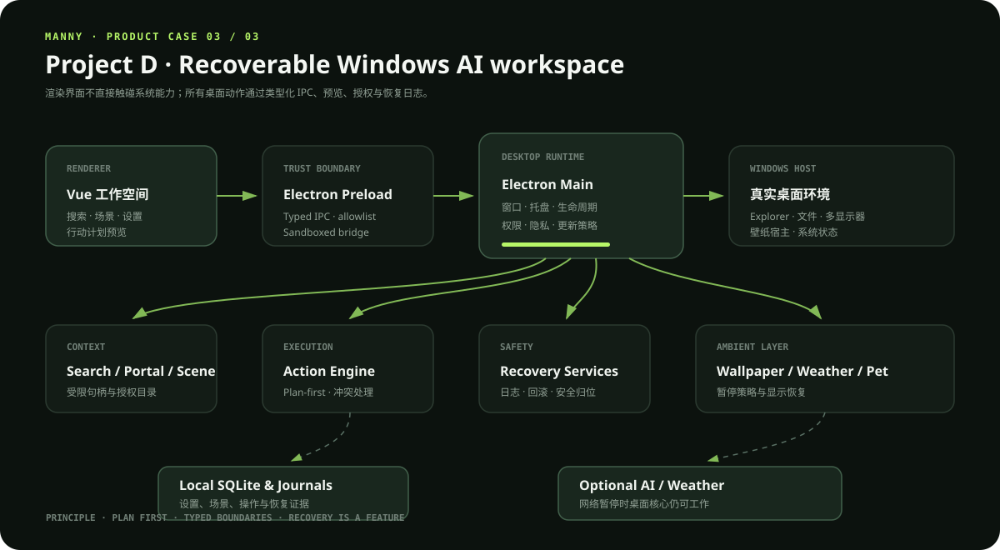

<div align="center">

**MANNY · PRODUCT CASE 03 / 03**

# Project D

### Local-first Windows AI workspace

把分散在桌面上的文件、搜索、整理建议、壁纸与个人 AI，收进一个可恢复、可预览的本地工作空间。

[](https://github.com/ningfangtianwai-pixel/project-d-desktop/releases/tag/v0.2.0-beta.1)
[](#本地运行)
[](https://github.com/ningfangtianwai-pixel/project-d-desktop/actions/workflows/quality-gate.yml)
[](https://www.typescriptlang.org/)

[产品案例](https://ningfangtianwai-pixel.github.io/#/project/project-d) · [交互 Demo](https://ningfangtianwai-pixel.github.io/#/demo/project-d) · [内测快照](./docs/INTERNAL_BETA_0.2.0-beta.1.md) · [用户指南](./docs/USER_GUIDE.md)

</div>



> **当前状态**：`0.2.0-beta.1` 已通过内部测试快照，不是公开商业发行版。安装包尚未签名，正式更新服务、商业资产授权和完整硬件矩阵验证仍是发布门槛。

## 为什么做 Project D

Windows 桌面承载了真实工作，但文件检索、归档、上下文切换和桌面维护仍然彼此割裂。Project D 的目标不是再做一个聊天窗口，而是让 AI 进入一个受控的桌面工作流：理解当前环境、提出行动计划、让用户确认，再执行可以恢复的操作。

```text
自然语言 / 桌面状态
        ↓
搜索与上下文组装
        ↓
可审阅的行动计划
        ↓
用户确认后执行
        ↓
操作日志与恢复中心
```

## 核心体验

| 能力 | 产品处理方式 |
| --- | --- |
| 桌面工作空间 | 在统一界面呈现桌面文件、收件箱、快捷入口与场景状态 |
| 本地搜索 | 通过受限、可过期的搜索句柄返回结果，不把原始路径直接暴露给渲染层 |
| Plan-first 整理 | 移动文件前生成目标位置、冲突处理和影响范围预览，由用户确认 |
| 安全恢复 | 通过操作日志、恢复中心、安全归位和 `Esc` 逃生机制保护真实桌面 |
| Local-first 数据 | 桌面索引、场景、设置和聊天记录默认保存在本机 |
| 环境体验 | 支持多显示器壁纸、天气状态、桌宠和可暂停的外部网络能力 |

## 真实界面

<table>
  <tr>
    <td width="50%"></td>
    <td width="50%"></td>
  </tr>
  <tr>
    <td align="center"><strong>桌面搜索</strong><br/>从本地工作环境中定位文件与入口</td>
    <td align="center"><strong>行动预览</strong><br/>真实文件操作前先检查计划和冲突</td>
  </tr>
  <tr>
    <td></td>
    <td></td>
  </tr>
  <tr>
    <td align="center"><strong>隐私中心</strong><br/>暂停外部网络、导出或删除本地数据</td>
    <td align="center"><strong>恢复中心</strong><br/>处理异常并恢复桌面状态</td>
  </tr>
</table>

[查看全部 24 张打包应用截图 →](./docs/screenshots/stage36/README.md)

## 我在项目中的角色

**独立产品设计与工程实现**：从真实桌面问题拆解、交互流程、Electron 架构和本地数据边界，到恢复机制、自动化测试与内测发布证据，完成端到端产品闭环。

关键产品决策：

- **先计划，再执行**：AI 输出必须先变成用户可检查的行动计划。
- **恢复能力是一等功能**：文件移动、桌面接管和异常退出都需要明确的恢复路径。
- **桌面核心与在线服务解耦**：外部网络暂停或提供商不可用时，本地桌面能力仍可工作。
- **用证据描述完成度**：内测结论对应自动化测试、打包运行验证、截图和已知限制，不用概念标签代替结果。

## 工程架构



[查看进程分层与动作安全边界 →](./docs/ARCHITECTURE.md)

| 层 | 技术与职责 |
| --- | --- |
| Renderer | Vue 3、TypeScript、Vite；工作空间、设置、搜索与计划预览 |
| Desktop runtime | Electron main/preload；窗口、系统托盘、桌面宿主和受控 IPC |
| Domain services | 搜索、文件夹门户、场景、行动引擎、恢复、隐私和更新策略 |
| Local data | SQLite/SQL.js；本地配置、场景、操作日志和恢复证据 |
| Quality | Node test runner、TypeScript checks、打包冒烟、SBOM、Gitleaks |

## 可验证证据

`0.2.0-beta.1` 内测快照记录：

- **167 / 167** 自动化测试通过。
- **39 / 39** 个声明模块可从打包后的 `app.asar` 正常加载。
- 生产渲染构建完成，共转换 **2,422** 个模块。
- 依赖审计在当次快照中报告 **0** 个已知安全发现。
- 强制进程重启、数据库完整性、桌面状态恢复和第二次优雅退出均通过。
- Windows 质量门禁与独立 Gitleaks 历史扫描通过。

完整范围、验证方法和未完成门槛见[内测快照](./docs/INTERNAL_BETA_0.2.0-beta.1.md)。

## 本地运行

### 环境

- Windows 10/11 x64
- Node.js 22
- pnpm 10

### 启动

```bash
git clone https://github.com/ningfangtianwai-pixel/project-d-desktop.git
cd project-d-desktop
pnpm install --frozen-lockfile
pnpm dev
```

AI 与天气提供商均为可选配置。复制 `.env.example` 并在本机填写密钥；不要提交真实密钥。

### 验证

```bash
pnpm test
pnpm typecheck
pnpm build
```

完整质量门禁还包含资产台账、发布生命周期、供应链证据与打包运行验证，详见 [`package.json`](./package.json) 和 [Quality Gate](./.github/workflows/quality-gate.yml)。

## 隐私与安全边界

- 用户数据默认保存在本机，云端 AI 和天气属于可选能力。
- 隐私中心可以暂停外部网络、导出数据和删除本地数据。
- 诊断导出要求显式同意，并对路径、令牌和密钥进行脱敏。
- 搜索结果通过受限句柄跨越进程边界，桌面操作通过预览、授权和恢复日志执行。
- 当前内测安装包**未进行代码签名**，不建议作为公开下载或付费版本分发。

## 当前边界

- 正式更新服务器与生产告警链路尚未启用。
- 商业资产许可证据尚未完成，因此仓库内媒体资产不代表可再分发授权。
- 完整物理多显示器/GPU/DPI 矩阵，以及 4 小时和 24 小时持续运行证据仍待补齐。
- 支付与账户部分是领域边界原型，不包含真实支付渠道、生产数据库或财务对账。

## 继续了解

- [产品案例：问题、角色、决策与结果](https://ningfangtianwai-pixel.github.io/#/project/project-d)
- [无需安装的交互 Demo](https://ningfangtianwai-pixel.github.io/#/demo/project-d)
- [公开文档导航](./docs/README.md)
- [用户指南](./docs/USER_GUIDE.md)
- [发布与稳定性手册](./docs/RELEASE_AND_STABILITY_RUNBOOK.md)
- [壁纸与媒体署名](./docs/WALLPAPER_CREDITS.md)

---

<div align="center">
  <a href="https://github.com/ningfangtianwai-pixel/talentflow-showcase">01 TalentFlow</a> ·
  <a href="https://github.com/ningfangtianwai-pixel/enterprise-evaluation-showcase">02 Enterprise Evaluation</a> ·
  <a href="https://github.com/ningfangtianwai-pixel/project-d-desktop"><strong>03 Project D</strong></a>
  <br/><br/>
  <strong>Built by Manny — AI products for real work.</strong>
</div>
