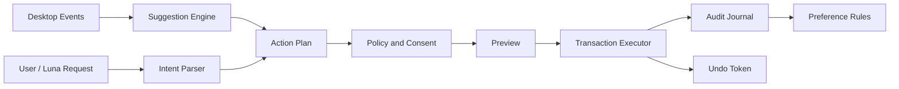

# Project D V2.1 商业级升级方案

> 文档性质：产品、工程与商业路线建议稿，不代表已经实现  
> 评审基线：`docs/V2_工程说明书.md` 与 Project D Stage 21 现状  
> 编写日期：2026-07-13

---

## 1. 执行结论

原 V2 方向中，文件夹门户、全局搜索、快捷键、主动建议、布局快照和新手引导都值得保留。但原方案仍然是“功能清单型升级”，不足以直接成为商业级产品。

Project D 真正应该建立的差异化不是“Fences + 壁纸 + 搜索 + 桌宠”的功能加法，而是：

> **一个本地优先、会理解桌面状态、能提出行动建议、执行前可预览、执行后可撤销，并通过 Luna 形成长期关系的 AI 桌面工作空间。**

建议把商业 V2 的核心闭环固定为：

```text
感知变化 -> 形成建议 -> 展示影响 -> 用户确认 -> 执行动作 -> 一键撤销 -> 学习偏好
```

如果没有“预览、确认、事务、撤销、审计”，AI 整理越主动，商业风险越大。如果有了这套可信行动内核，文件门户、搜索、场景、桌宠和 AI 才会成为同一个产品，而不是五个并列模块。

### 对原 V2 的四项关键修正

1. **从功能数量改为高频工作流。** 360 桌面助手已经提供整理、全盘搜索、待办和壁纸；元气桌面也提供壁纸、特效与桌面整理。只补齐这些功能属于进入牌桌，不构成优势。
2. **从 AI 文案改为 AI 行动。** Luna 不只说“需要我整理吗”，还必须能给出具体方案、影响文件列表和撤销入口。
3. **从四周堆功能改为十二至十五周的商业化闸门。** 当前 Electron、安装签名、升级、崩溃恢复、隐私授权、多屏和长期稳定性均需先补齐。
4. **从统一大而全版本改为本地 Pro、可选云 AI 和内容包三条收入线。** 不应靠限制安全能力、撤销能力或基础人格制造付费点。

---

## 2. 市场对标结论

### 2.1 竞品不是一个，而是六类能力

| 产品 | 已验证的核心优势 | Project D 应借鉴 | 不应照搬 |
|---|---|---|---|
| Stardock Fences 6 | 自动规则、Folder Portals、Peek、标签页、个性化和企业部署 | 门户、Peek、规则、场景和部署可靠性 | 只做一个更漂亮的 Fences 克隆 |
| Everything | 极快文件名索引、低资源、实时更新 | 作为全盘搜索提供者，而不是自己重造索引器 | 在 Electron 主进程中遍历全盘并维护巨大内存 Map |
| Flow Launcher / PowerToys Command Palette | 全局热键、即时搜索、上下文动作、扩展生态 | 搜索即行动、键盘优先、动作菜单、提供者接口 | V2 就开放不受控插件执行本地代码 |
| Wallpaper Engine / Lively | 多屏、性能暂停规则、播放列表、内容与创作生态 | 全屏/电池/远程桌面自动暂停，场景播放列表 | 在轻薄本上默认开启高负载特效 |
| Desktop Mate | 窗口顶部角色、鼠标互动、语音、闹钟、免费本体加角色 DLC | 角色表现、互动反馈、内容包商业化 | 把角色 IP 数量当作核心生产力能力 |
| 360 / 元气桌面 | 整理、搜索、待办、壁纸的一站式覆盖 | 中文用户的低学习成本与一键入口 | 广告、捆绑、资讯流和不透明数据行为 |

一手资料显示：Fences 把 Folder Portals、Peek 和自动规则作为核心生产力卖点；Wallpaper Engine 和 Lively 都强调全屏、游戏、电池等状态下的性能暂停；PowerToys Command Palette 与 Flow Launcher 都把扩展式搜索和动作作为中心；Desktop Mate 采用免费本体加大量付费角色 DLC 的模式。来源见文末。

### 2.2 Project D 的竞争空位

目前这些产品分别解决“整理”“寻找”“美化”“陪伴”，但没有把以下能力完整合并：

- 桌面和工作文件的本地状态感知；
- 自然语言理解用户意图；
- 对真实文件操作给出可审查计划；
- 所有改变可以撤销和追溯；
- 由一个有性格、有状态但不过度打扰的角色承载交互。

这正是 Project D 可以占据的位置。产品不应宣传为“桌面美化全家桶”，而应宣传为：

> **Luna 帮你找回文件、恢复工作现场、整理桌面，而且任何改动都先给你看、随时能撤销。**

---

## 3. 目标用户与首发边界

### 3.1 首要用户

- 桌面和下载目录长期堆积 10 至 100 个文件的知识工作者；
- 经常在多个项目之间切换的设计、运营、内容创作者和自由职业者；
- 喜欢桌面美学和角色陪伴，但使用的是集成显卡轻薄本的年轻用户；
- 对文件安全敏感，不愿把完整路径和文件内容上传云端的用户。

### 3.2 暂不作为 V2 首发重点

- 需要集中策略、MDM 和审计的企业大客户；
- 依赖完整屏幕历史记录的 Recall 型用户；
- 需要跨 Windows/macOS/Linux 同功能的用户；
- 追求 3D 多角色同屏或高端 GPU 特效的用户。

V2 建议明确为 **Windows 11 优先、Windows 10 尽力兼容的单用户桌面产品**。当前代码包含 macOS/Linux 打包目标，但 Progman/WorkerW、Explorer 图标和 Windows 快捷键均为平台特有能力；在没有对应宿主实现前，不应对外宣称跨平台。

---

## 4. 四个商业级主工作流

### 4.1 桌面收件箱：从“自动整理”升级为“安全清空”

场景：用户下载、截图或临时保存了一批文件。

完整体验：

1. Project D 通过文件事件发现新增内容；
2. Luna 安静显示“新增 8 个文件，其中 5 个像是本周项目资料”；
3. 用户点击后看到拟议分组、目标位置和冲突项；
4. 用户可逐项取消，也可选择“仅虚拟分组”或“真实移动”；
5. 执行成功后出现 30 秒撤销条，历史中心长期保留撤销记录；
6. 用户的选择形成可编辑规则，而不是黑盒模型记忆。

商业价值：这是用户每周反复发生、可以明显节省时间、也最能建立信任的核心循环。

### 4.2 找到并行动：搜索结果不是终点

场景：用户按全局快捷键输入“找上周改过的报价单”。

完整体验：

- 先用本地结构化解析识别日期、扩展名、目录和关键词；
- 通过 Everything、Windows Search 或 Project D 局部索引返回结果；
- 每条结果提供打开、定位、复制路径、加入门户、放入当前场景等动作；
- 只有无法可靠解析时才调用云端 LLM；
- 未经明确许可，不向云端发送完整路径、文件名列表或文件内容。

商业价值：搜索工具很多，但“找到后直接进入当前工作空间”可以与场景、门户和 Luna 形成联动。

### 4.3 工作场景：把布局快照升级为 Workspace Scene

原 V2 的布局快照只保存容器位置、配色、门户和壁纸，建议升级为完整场景：

- 容器与门户；
- 壁纸、天气效果强度与桌宠状态；
- 常用文件、文件夹和应用入口；
- 待办摘要；
- 显示器映射；
- 静音、专注和性能策略。

用户可创建“工作”“直播”“学习”“纯净展示”等场景，通过托盘、快捷键或 Luna 切换。场景是 Project D 把生产力与美学连接起来的关键对象，也比单独的便签或配色更有付费价值。

### 4.4 Luna 主动建议：少而准、可以执行

主动建议必须由事件触发和预算控制，而不是每 15 分钟轮询一次：

- 新文件批量到达；
- 下载完成；
- 文件冲突或重复；
- 场景切换；
- 工作日开始/结束；
- 桌面项目长期未归档。

每条建议应包含：原因、建议动作、影响范围、“查看方案”“稍后”“不再提醒”三个入口。人格只改变表达方式，不改变安全策略。

必须提供：安静时段、每小时提醒上限、全屏/会议/游戏暂停、按类型关闭、永久静音和历史记录。

---

## 5. 商业级可信行动内核

### 5.1 核心原则

AI 不直接拥有任意文件系统权限。AI 只能生成受限的结构化 `ActionPlan`，由策略引擎验证，再由事务执行器执行。



### 5.2 必须建立的领域对象

- `DesktopResource`：桌面文件、门户文件、快捷方式、文件夹或应用的统一引用；
- `ResourceOrigin`：真实桌面、门户、搜索结果、场景固定项；
- `ActionPlan`：动作、来源、目标、冲突、风险级别和预估影响；
- `ActionExecution`：实际执行结果及逐项状态；
- `UndoToken`：恢复所需的原路径、别名、布局或配置；
- `Suggestion`：触发原因、置信度、冷却时间和可执行计划；
- `WorkspaceScene`：桌面工作空间的完整可恢复快照；
- `ConsentScope`：允许扫描、索引、发送给 AI 或自动处理的目录范围。

### 5.3 动作风险分级

| 级别 | 示例 | 默认策略 |
|---|---|---|
| L0 只读 | 搜索、预览、统计 | 可直接执行，仍写审计 |
| L1 虚拟变化 | 虚拟分组、别名、容器配色 | 可一次确认后自动执行，可撤销 |
| L2 可恢复文件动作 | 移动、重命名、建立文件夹 | 必须展示预览和冲突处理，可撤销 |
| L3 破坏性动作 | 删除、覆盖、跨盘大量移动 | V2 默认禁止自动执行，必须逐次确认 |

撤销、恢复和审计能力属于安全基础设施，任何版本都不能收费锁定。

### 5.4 恢复中心

商业版应把恢复能力做成用户可见页面，而不是藏在日志和批处理文件中。恢复中心至少包含：

- 最近操作、每一步结果和失败原因；
- 可撤销、已撤销和不可撤销状态；
- 自动布局快照、手动 Workspace Scene 快照；
- 文件冲突、跳过项和需要人工处理的项目；
- Explorer 图标、壁纸宿主、桌宠窗口和快捷键注册状态；
- 导出诊断包前的文件清单、脱敏预览和排除项。

“我可以安全试一下，因为随时能回来”应成为 Project D 的品牌承诺。

---

## 6. 工程架构调整

### 6.1 当前基线风险

当前项目可运行，但距离商业发布仍有以下工程缺口：

- Electron 为 28.3.3，而 2026-07-13 官方稳定版本已经是 43.1.0；旧版本不应继续作为商业发布基线；
- `main.ts` 约 1078 行并包含约 39 个 IPC handler；
- `database.ts` 约 907 行，缺少正式 schema version 和迁移流水线；
- 多个窗口显式设置 `sandbox: false`；
- 当前没有自动更新、签名发布、崩溃报告、许可证或发布通道；
- Windows 原生功能与 macOS/Linux 打包声明不一致。

Electron 官方安全清单要求使用当前版本、启用上下文隔离和进程沙箱、限制导航、验证 IPC sender 并设置 CSP；官方也明确建议商业分发进行代码签名和自动更新。

### 6.2 建议模块边界

```text
src/main/
  app/                 生命周期、窗口、托盘、快捷键、更新
  ipc/                 按领域拆分的 IPC router 与 sender 校验
  desktop/             Explorer/Progman 适配、文件事件
  resources/           DesktopResource 与 provider registry
  portals/             Folder Portal provider
  search/              Everything / Windows Search / Local providers
  actions/             plan、policy、transaction、undo、audit
  suggestions/         规则引擎、节流和偏好
  luna/                对话、tool calling、人格表达
  scenes/              Workspace Scene
  persistence/         DB、migration、repository、backup
  commercial/          license、entitlement、update channel
```

渲染进程只展示状态并发出类型化命令；文件监听、索引、AI 请求和真实文件操作都不能阻塞 Electron 主线程。高耗时任务应进入 worker 或独立 utility process。

### 6.3 文件夹门户的修正模型

原方案把门户文件写入 `desktop_files` 并增加 `is_portal`，容易造成来源混乱、重复记录和误操作。建议：

- `portal_configs` 只保存目录授权、显示设置和刷新策略；
- 门户内容通过 `PortalResourceProvider` 动态查询；
- `DesktopResource` 记录稳定资源 ID 与 origin，不复制成真实桌面记录；
- `fs.watch` 只用于唤醒，实际变更使用 debounce 后目录重扫校正；
- 明确处理网络盘离线、权限拒绝、符号链接/重解析点、超大目录和文件名冲突；
- 默认只读门户，真实移动或删除必须通过 Action Engine。

### 6.4 搜索的修正模型

不建议自己从零构建全盘索引。Everything 官方强调快速文件名索引、实时更新和低资源，并提供 IPC/SDK；Flow Launcher 也直接复用 Everything 或 Windows Search。

建议提供者优先级：

1. 已安装 Everything 且用户授权时，使用 Everything IPC；
2. 否则使用 Windows Search；
3. 最后使用 Project D 局部索引，只索引桌面和用户明确添加的门户。

Project D 自己的价值应放在自然语言意图、结果融合、当前场景排序和后续动作，而不是重复造一个 NTFS 索引服务。

### 6.5 数据迁移和恢复

V2 必须引入：

- 单调递增 `schema_version`；
- 每个版本独立、可重复执行的 migration；
- 升级前数据库备份；
- 迁移失败自动回滚并进入安全模式；
- 数据库完整性检查与“导出诊断包”；
- 对配置、动作日志和聊天记录分别设置保留周期。

---

## 7. 本地优先隐私模型

Project D 不应复制 Recall 的全屏截图路线。Microsoft 为 Recall 配置了本地分析、加密向量数据库、Windows Hello、TPM/VBS、敏感信息过滤、应用/网站排除和企业策略；这说明持续桌面感知需要非常高的安全成本。

V2 建议只处理：

- 用户明确授权目录中的文件元数据；
- 用户主动选择的文件内容预览；
- Project D 自己产生的动作历史；
- 可选、明确开启的聊天记忆。

默认禁止：

- 持续截屏；
- 扫描浏览器隐私窗口；
- 自动读取所有文档正文；
- 将完整文件名、路径或内容发送到云端；
- 用隐含同意扩大目录授权。

设置页必须有“数据与隐私”页面，展示已授权目录、云端发送范围、最近 AI 请求摘要、数据占用、一键暂停、导出和彻底删除。

---

## 8. 轻薄本性能预算

Wallpaper Engine 与 Lively 都把全屏、游戏、电池和远程桌面暂停作为核心能力。Project D 应把性能策略提升为产品承诺，而不是设置页中的附加选项。

建议发布 SLO：

| 指标 | Balanced 目标 |
|---|---|
| 空闲 CPU | 5 分钟平均不高于 1% |
| 空闲总工作集 | 不高于 350 MB，首次以实测基线校准 |
| 覆盖层暖启动 | P95 不高于 200 ms |
| Everything 首批搜索结果 | P95 不高于 150 ms |
| Windows Search/局部索引结果 | P95 不高于 800 ms |
| 全屏应用 | 壁纸动画、粒子和桌宠漫游暂停 |
| 电池模式 | 降至 15/30 FPS 或静态帧，暂停非必要 AI |
| 远程桌面 | 默认静态壁纸且关闭透明特效 |

性能模式不应只减少粒子数量，还要统一控制壁纸帧率、桌宠动作、索引并发、AI 后台任务和透明效果。

---

## 9. 商业模式建议

### 9.1 推荐采用混合模式

| 层级 | 建议能力 | 收费逻辑 |
|---|---|---|
| Free | 基础整理、1 个门户、本地搜索、1 个场景、基础 Luna、基础壁纸、自带 AI Key | 足以验证真实价值，不靠广告 |
| Pro 永久版 | 无限门户/场景、自动规则、高级搜索动作、完整外观、BYOK 多模型、批量可撤销操作 | 为本地生产力能力一次付费 |
| Luna Plus 可选订阅 | 官方托管 AI 额度、跨设备偏好同步、云备份、语音包服务 | 只为持续产生云成本的能力订阅 |
| 内容包 | 角色、服装、语音、动作、壁纸场景包 | 参考 Desktop Mate 的 DLC，但必须拥有或取得授权 |
| Business 后续版 | 部署、策略、配置锁定、审计导出、集中授权 | V2 消费版稳定后再做年费席位 |

### 9.2 不建议沿用的付费限制

- 不限制撤销、恢复、隐私和安全功能；
- 不把自定义图片只留给 Pro；
- 不用“3 种人格 vs 8 种人格”作为主要升级理由；
- 不把本地搜索完全锁在付费墙后；
- 不在 Free 版加入广告、资讯流或捆绑安装。

### 9.3 待验证的价格假设

价格应通过封闭测试验证，不在工程阶段硬编码。可测试区间：

- Pro 年费：人民币 68、98、128 元三档测试；
- Pro 限定版本永久许可：人民币 168 至 228 元；
- Luna Plus：人民币 15 至 25 元/月；
- 原创角色或场景内容包：人民币 18 至 48 元，高成本语音或正版 IP 单独定价。

建议同时测试年费和限定版本永久许可，不承诺永久许可包含无限期云 AI。可选订阅只覆盖托管模型和同步成本，内容包承担审美与角色收入。

### 9.4 受控内容与扩展生态

V2 不直接开放能执行任意代码的插件商店，先支持三种受控包：

- `Scene Pack`：壁纸、布局、容器主题、天气表现、环境音和性能预设；
- `Action Pack`：只能调用 Project D 已授权动作 API 的声明式流程；
- `Character Pack`：角色资源、动作图、语音、人格表达和授权信息。

每个包必须声明：包 ID、版本、最低兼容版本、权限、网络能力、资源预算、作者、许可证、素材来源和签名。新增权限的更新必须重新征得用户同意；包崩溃或超出预算时可以自动隔离和一键禁用。

这样可以先建立可销售内容单位，再在后续版本评估隔离进程中的受限脚本运行时。

---

## 10. 原 V2 功能取舍

| 原方案项目 | 新决策 | 说明 |
|---|---|---|
| 拉绳改回风格切换 | 暂不回退 | Stage 21 已统一显示“壁纸名 · 风格”；后续增加“按风格播放列表”，不再反复改变基础语义 |
| 宠物人格点击 | 已完成 | 保留现实现 |
| 当前壁纸反馈 | 已完成 | 保留现实现 |
| 聊天清空与聚焦 | 已完成 | 保留现实现 |
| 右键菜单图标 | 近期完成 | 视觉完善项，不是商业壁垒 |
| 文件夹门户 | P1 核心 | 改为 Resource Provider，不混入桌面记录 |
| AI 整理建议 | P1 核心 | 规则优先、事件驱动、带动作预览和撤销 |
| 快捷键 | P1 核心 | 增加冲突检测、重绑定、全屏禁用和失败降级 |
| 待办便签 | 延后 | 通用待办已经高度同质化；先做场景内任务摘要或连接现有待办 |
| AI 桌面搜索 | P2 核心 | 接入搜索提供者，不自建全盘 Map |
| 主动建议 | P2 核心 | 合并到 Suggestion Engine，不在 PetPage 定时轮询 |
| 容器配色 | P2 次要 | 作为场景视觉能力交付 |
| 布局快照 | 升级为场景 | 保存布局、门户、壁纸、应用入口和性能策略 |
| 新手引导 | 商业 Beta 必须 | 以第一次“搜索成功、整理并撤销、保存场景”为激活目标 |
| 数据看板 | 不做用户主功能 | 改为隐私友好的产品指标和动作历史；避免无价值统计 |
| Free vs Pro | 重做 | 安全能力永久免费，本地 Pro 一次付费，云 AI 可选订阅 |

---

## 11. 分阶段路线图

原方案“25 天完成全部功能”不适合商业发布。建议按可验收闸门推进，共 12 至 15 周；若只做可演示 V2 Beta，可压缩到 8 至 10 周，但不能跳过安全行动内核。

### Gate 0：商业基础与技术升级，2 至 3 周

- Electron 28 分阶段升级到仍受支持的稳定版本；
- 启用 renderer sandbox，补 IPC sender 校验、导航限制和 CSP 回归；
- 拆分窗口生命周期、IPC router 和数据库 repository；
- 建立 schema migration、升级前备份和恢复模式；
- Windows-only 发布声明；
- 性能基线、崩溃基线和自动化安装测试。

**退出标准：** 当前 V1 功能无回归；数据库升级失败可自动恢复；安全检查通过；24 小时空闲/交互浸泡无阻断错误。

### Gate 1：可信行动与桌面收件箱，3 周

- Event Journal；
- Action Plan / Policy / Transaction / Undo；
- 新增文件建议；
- 虚拟整理与真实移动预览；
- 动作历史、撤销和冲突处理；
- 右键菜单视觉完善。

**退出标准：** 所有真实文件动作都有预览、逐项结果和撤销；进程在动作中被杀死后可以恢复一致状态。

### Gate 2：门户、Peek 与场景，3 周

- 只读 Folder Portal；
- 目录权限、离线和大目录保护；
- Peek 全局快捷键与可重绑定系统；
- Workspace Scene 保存/恢复；
- 多显示器场景映射；
- 统一性能策略。

**退出标准：** 门户实时更新但不会误改原目录；场景在 1 至 3 屏与 100% 至 200% DPI 下可恢复；快捷键冲突有清晰反馈。

### Gate 3：搜索与 Luna 行动编排，3 至 4 周

- Everything / Windows Search / 局部索引 provider；
- 搜索浮窗和键盘完整操作；
- 本地结构化意图解析；
- Luna tool calling 只生成 Action Plan；
- 事件驱动主动建议、冷却与免打扰；
- 搜索和建议的可解释性。

**退出标准：** 常用搜索 P95 达标；云 AI 离线时基础搜索和规则仍可用；未经授权不会上传文件元数据。

### Gate 4：商业 Beta，2 至 3 周

- 价值导向 onboarding；
- Free/Pro entitlement；
- 许可证恢复和离线宽限；
- 代码签名、自动更新、灰度通道与回滚；
- 隐私中心、诊断导出和可选崩溃报告；
- 角色/场景内容包规范；
- 支持文档、卸载恢复和退款路径。

**退出标准：** 干净账户完成安装、升级、降级/回滚、卸载；安装包无 SmartScreen 身份警告；发布通道可以暂停；用户数据可导出和彻底删除。

---

## 12. 商业验收指标

### 12.1 用户价值

- 首次启动 10 分钟内完成一次成功搜索；
- 首次启动 15 分钟内完成一次有预览的整理并理解撤销入口；
- 7 天内至少恢复一个 Workspace Scene；
- 搜索结果点击成功率不低于 80%；
- Luna 建议接受率不低于 20%，永久关闭率低于 10%。

### 12.2 安全与可靠性

- 100% 的真实文件动作进入 Action Engine；
- 100% 的 L2/L3 动作有明确确认；
- 自动化故障注入下不出现不可恢复的数据丢失；
- Beta crash-free session 不低于 99.5%；
- Explorer 重启、睡眠唤醒、显示器热插拔各循环 20 次无永久失联；
- 连续运行 24 小时无持续内存增长，发布前完成 7 天稳定性抽测。

### 12.3 商业与信任

- Free 到 Pro 转化、退款率和卸载原因可测但默认匿名；
- 诊断与产品分析必须明确选择加入；
- 无广告、无资讯流、无捆绑安装；
- 所有内容包都有版权和来源台账；
- 所有版本均提供恢复桌面、撤销和隐私删除。

---

## 13. 近期决策建议

建议下一轮正式立项时确认以下六项，并作为 V2 不再摇摆的产品原则：

1. Project D 定位为“本地优先 AI 桌面工作空间伴侣”；
2. Windows 11 优先，V2 暂不承诺 macOS/Linux；
3. AI 不直接操作文件，只能提交受限 Action Plan；
4. 不做持续截屏和 Recall 型历史；
5. 搜索使用 provider 架构，优先复用 Everything/Windows Search；
6. 本地 Pro 一次付费，托管 AI 和内容包分开收费。

确认后，应先编写 `V2_DOMAIN_MODEL.md`、`V2_ACTION_SAFETY_SPEC.md`、`V2_PRIVACY_SPEC.md` 和 `V2_RELEASE_GATES.md`，再进入代码阶段。不要直接从原 V2 的七个新文件清单开始开发。

---

## 14. 一手资料

- [Stardock Fences 6 官方页面](https://www.stardock.com/products/fences/)：自动规则、Folder Portals、Peek、定制、订阅/永久授权和企业部署。
- [Wallpaper Engine 官方页面](https://www.wallpaperengine.io/en)：性能暂停、多屏、播放列表、编辑器、社区内容与一次性购买模式。
- [Lively Wallpaper 官方 GitHub](https://github.com/rocksdanister/lively)：多类型壁纸、性能规则、API、自动化、开源和低配置要求。
- [Everything 官方页面](https://www.voidtools.com/)：快速文件名索引、实时更新和低资源。
- [Everything 官方许可证](https://www.voidtools.com/License.txt)：允许使用、修改、分发和商业处理，但需要保留声明。
- [Flow Launcher 官方页面](https://www.flowlauncher.com/)：全局热键、Everything/Windows Search、插件和多语言扩展。
- [PowerToys Command Palette 官方文档](https://learn.microsoft.com/windows/powertoys/command-palette/overview)：文件/应用/命令搜索、上下文动作、Dock 与扩展模型。
- [PowerToys Command Palette 扩展架构](https://learn.microsoft.com/windows/powertoys/command-palette/extensibility-overview)：扩展独立进程与 Windows App Extension 隔离。
- [Desktop Mate Steam 官方商店页](https://store.steampowered.com/app/3301060/Desktop_Mate/)：窗口顶部角色、鼠标互动、语音、闹钟、免费本体和角色 DLC。
- [360 桌面助手官方页面](https://www.360.cn/desktop/)：整理、全盘搜索、待办和壁纸已经是国内桌面助手基础组合。
- [元气桌面官方页面](https://www.yuanqidesk.com/)：动态壁纸、粒子、鼠标效果与桌面整理。
- [Microsoft Recall 管理与隐私架构](https://learn.microsoft.com/windows/client-management/manage-recall)：本地分析、加密、Hello/TPM/VBS、敏感信息过滤和企业策略。
- [Electron 安全指南](https://www.electronjs.org/docs/latest/tutorial/security)：当前版本、沙箱、context isolation、CSP、导航和 IPC 安全要求。
- [Electron 性能指南](https://www.electronjs.org/docs/latest/tutorial/performance)：主进程阻塞、依赖成本和持续测量要求。
- [Electron 官方发布列表](https://releases.electronjs.org/)：2026-07-07 的稳定版本 43.1.0。
- [Electron 应用更新指南](https://www.electronjs.org/docs/latest/tutorial/updates)：Windows/macOS 自动更新和发布元数据。
- [Electron 代码签名指南](https://www.electronjs.org/docs/latest/tutorial/code-signing)：商业分发签名和 Windows 签名选项。
- [Microsoft Windows 代码签名选择](https://learn.microsoft.com/windows/apps/package-and-deploy/code-signing-options)：Store MSIX 重签名、SmartScreen 与外部分发签名要求。
