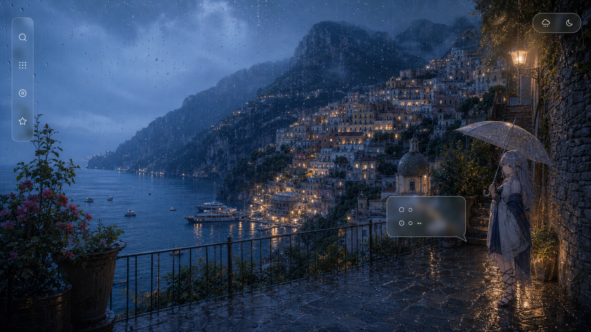
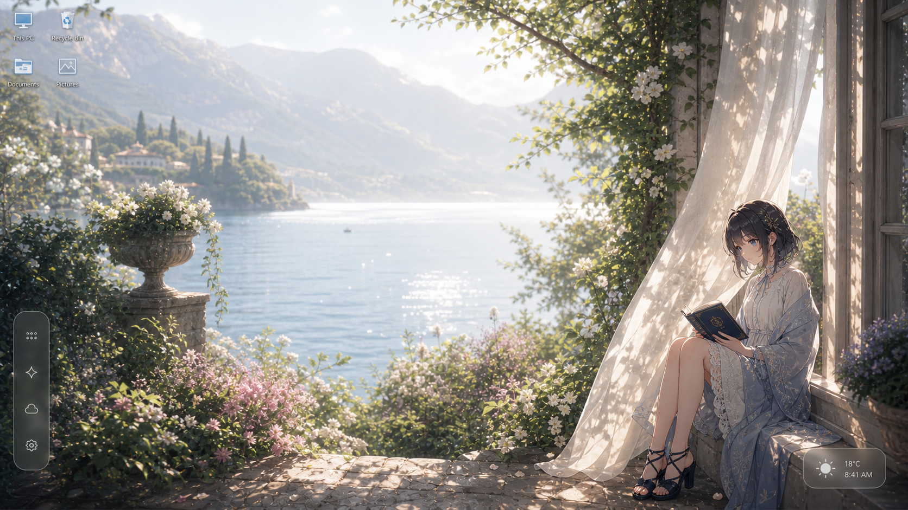
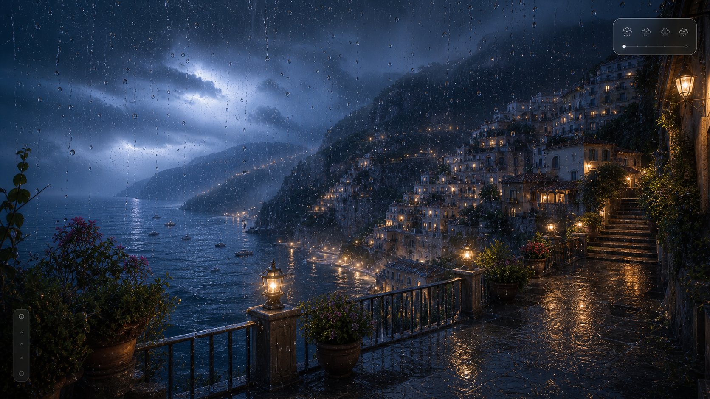
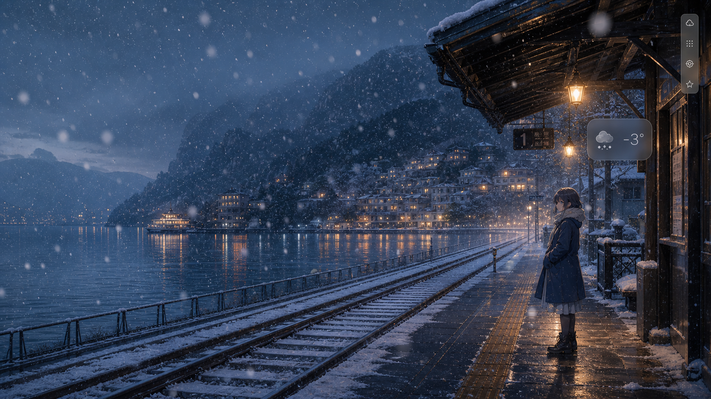
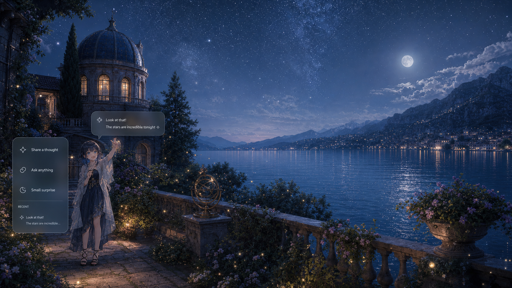
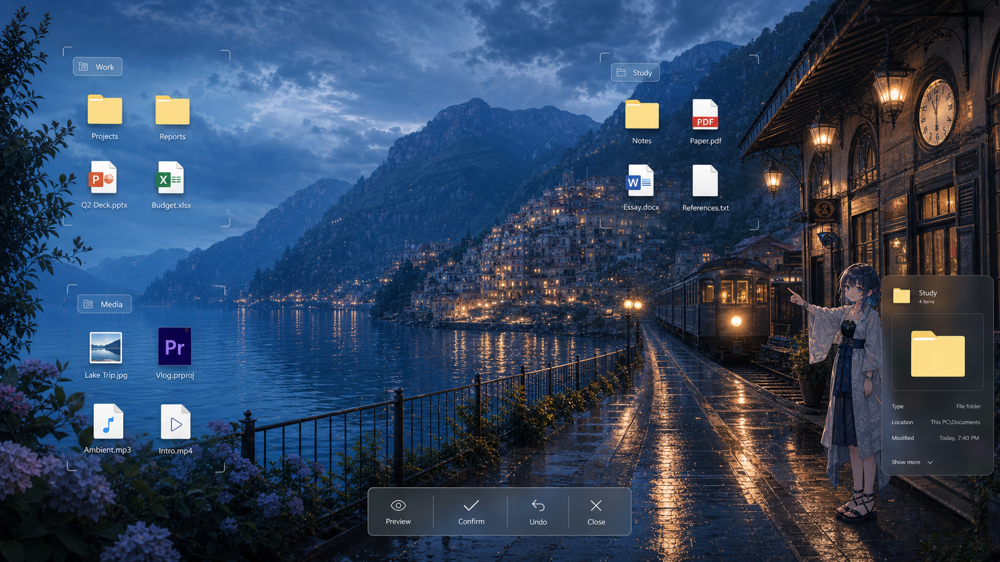
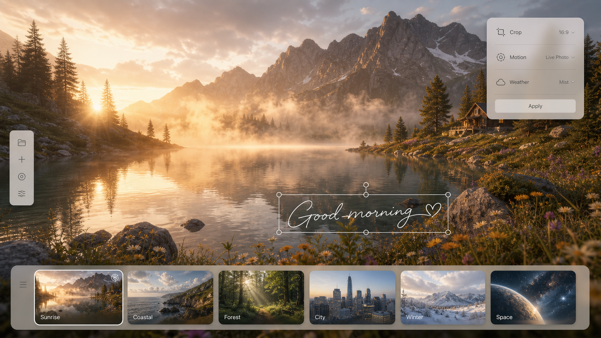
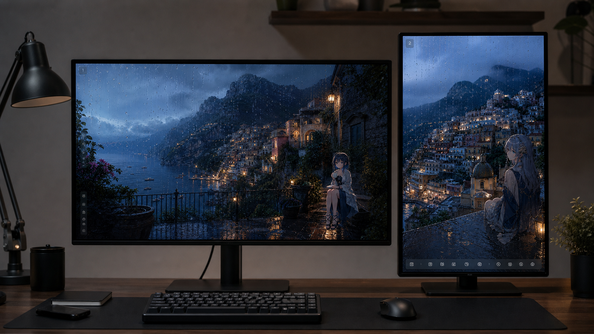

# Project D V5.1 壁纸主导沉浸式桌面成品计划

- 版本：V5.1 Experience Baseline
- 日期：2026-07-24
- 适用范围：个人使用优先、开放源代码、Windows 10 / 11
- 代码基线：`codex/v4-free-release` / `524a5c2` / `0.3.0-dev.0`
- 上游文档：`ProjectD_V4.0_沉浸式桌面层体验收敛计划.md`
- 状态：设计、实现与验收的统一执行基线

## 1. 评审结论

原计划的产品判断是正确的：Project D 当前不是缺功能，而是功能同时争夺注意力。它已经能整理、搜索、换壁纸、显示天气、陪伴和恢复，但第一眼仍像一个覆盖在壁纸上的管理控制台。

原计划最值得保留的是四件事：

- 壁纸优先，默认不展示大型文件容器。
- 高频入口贴边，任务能力按需出现。
- 同一时刻只展开一个主要工作面。
- 任何视觉调整都不能削弱确认、撤销和桌面恢复。

原计划不能直接作为现阶段施工图，主要有以下原因：

| 维度 | 评价 | 需要修正 |
|---|---:|---|
| 产品方向 | 9/10 | 继续坚持壁纸主导与单任务展开 |
| 工程安全 | 9/10 | 复用现有恢复、暂停和可信行动链 |
| 视觉具体度 | 6/10 | 缺少景深、材质、主体避让和量化令牌 |
| 当前基线准确度 | 5/10 | 仍以 `0.2.0-beta.1` 为基线，落后于 Stage 53 |
| 执行映射 | 7/10 | 没有充分映射到当前 Vue 组件和窗口职责 |
| 个人开源适配 | 6/10 | 商业门禁比重过高，素材边界不够明确 |

综合评价：原计划适合作为“方向宣言”，不够精确到可以直接验收。本计划保留其正确内核，并把它升级成视觉、交互、工程和测试可以互相校验的成品方案。

## 2. 当前真实基线

截至本计划建立时，项目已经完成 Stage 53。最近一次完整验证为 216/216 测试通过，类型检查、Lint、构建、壁纸库 QA 和天气视觉 QA 均通过。

已经具备并应保护的能力：

- 静态、视频和 Live Photo 壁纸库、宿主、失败封面与多屏映射。
- 雨、雪、雾、落叶、光效和四档性能策略。
- 五个桌宠、六类动作槽、八种人格、话频率与 AI 上下文。
- 桌面扫描、虚拟容器、文件夹预览、搜索、门户、场景和钉选资源。
- ActionPlan 预览、确认、冲突、撤销、中断恢复和审计记录。
- 纯净桌面、安全归位、图标与任务栏恢复、异常退出看门狗。
- BYOK、Windows 安全存储、隐私暂停、脱敏诊断和缓存清理。
- Electron 43、SQL.js、打包、SBOM、供应链与独立 E2E。

当前体验的主要问题来自默认组合方式：

- `App.vue` 同时展示分区网格、控制中心、聊天、状态和多排动作。
- `OverlayPage.vue` 虽已透出壁纸，但仍以完整容器矩阵为主要构图。
- `styles.css` 已超过 3000 行，状态与材质令牌混在页面样式中。
- `WallpaperStage.vue` 有天气层，但缺少统一的场景构图与主体避让模型。
- `PetPage.vue` 有人格与动作，但角色仍像独立窗口内容，而不是壁纸世界的一部分。
- Live Photo 已有配对与容器校验，尚缺导入前真实播放预览和解码探测。

结论：V5.1 不新增第六个核心模块。工作重点是重组已有能力，并建立真正可持续的视觉系统。

## 3. 产品北极星

Project D 不是“带壁纸的文件管理器”，也不是替代 Explorer 的新桌面。

它应当是一张会呼吸的 Windows 桌面：

> 壁纸构成世界，天气改变空气，桌宠生活在其中，工具只在边缘等待，任务完成后重新退回安静。

用户启动后第一眼应感受到画面，而不是功能。用户需要功能时，入口必须容易找到；用户完成任务后，功能必须主动退场。

## 4. 成品体验原则

### 4.1 壁纸是舞台

- 安静态至少 90% 的屏幕不被大型 UI 覆盖。
- 壁纸主体、脸部、地标和强光焦点不得被默认控件遮挡。
- 明暗、色调和空间感来自壁纸本身，不使用大面积假渐变替代内容。
- 动态壁纸和 Live Photo 必须有静态封面，失败时不出现黑屏。

### 4.2 功能默认休眠

- 安静态一级入口最多 4 个。
- 搜索、整理、场景、壁纸库和完整对话均按需展开。
- 同一时刻只允许一个主要任务面。
- 任务完成、关闭或失焦后，界面回到安静态。

### 4.3 桌宠属于场景

- 桌宠不是固定右侧挂件，也不是永远漂浮在最前面的贴纸。
- 角色应根据壁纸负空间、任务栏安全区和显示器方向选择停留带。
- 人格、气泡、表情、动作和 AI 口吻必须来自同一个状态决策。
- 全屏、演示和专注状态下，桌宠降频、静止或隐藏。

### 4.4 天气改变空气

- 天气不是一层均匀线条，而是近景、中景、远景和环境光的组合。
- 雨、雪和雾必须与壁纸亮度、地平线和光源发生视觉关系。
- 用户可以单独控制天气强度，系统可以因性能自动降级。
- 天气层不抢鼠标，不遮挡关键文字，不制造全屏持续模糊。

### 4.5 工具服从画面

- 控件优先占用壁纸负空间和显示器安全边缘。
- 工具轨允许左右换边；竖屏时允许移动到底部。
- 玻璃必须透出局部壁纸颜色，而不是变成黑色面板。
- 安全、确认和错误状态可以牺牲透明度，不能牺牲可理解性。

### 4.6 Windows 始终可恢复

- 不替换 Explorer，不把结束 Explorer 当成常规流程。
- 不永久隐藏、移动或删除原生桌面项目。
- 退出后恢复图标、任务栏、系统壁纸和输入路径。
- 安全归位始终高于审美、动效和自动收起。

## 5. 七层桌面模型

下表描述体验层级，不等同于简单的 CSS `z-index`。

| 层级 | 名称 | 内容 | 输入策略 | 失败策略 |
|---|---|---|---|---|
| L0 | Windows 原生层 | Explorer 图标、任务栏、系统交互 | Windows 管理 | Project D 退出后完整可用 |
| L1 | 壁纸世界层 | 静态、视频、Live Photo、每屏裁剪 | 默认穿透 | 保留上一帧或静态封面 |
| L2 | 环境层 | 雨、雪、雾、落叶、光晕、环境调色 | 永远穿透 | 降级为静态调色或关闭 |
| L3 | 角色层 | 桌宠、动作、气泡、局部交互 | 仅角色命中区接收 | 角色隐藏不影响桌面 |
| L4 | 边缘工具层 | 快捷轨、状态胶囊、壁纸切换 | 精确命中 | 可从托盘或快捷键恢复 |
| L5 | 临时任务层 | 搜索、整理、场景、壁纸库、对话 | 单任务独占 | 保留草稿并安全关闭 |
| L6 | 安全恢复层 | 错误说明、恢复进度、紧急归位 | 明确阻断 | 可执行真实恢复动作 |

核心约束：

- L1-L2 不接收鼠标。
- L3 只在角色和气泡轮廓内接收鼠标。
- L4 只在可见控件命中区接收鼠标。
- L5 之外的透明区域尽量穿透。
- L6 可以提高不透明度，但必须说明影响和恢复结果。

## 6. 五种界面状态

### 6.1 安静态

- 完整壁纸、环境天气和桌宠可见。
- 只显示一个 4 项快捷轨和一个小型状态胶囊。
- 不显示品牌大标题、文件数量、完整聊天或容器矩阵。
- 桌宠气泡默认隐藏，只有事件或点击后短时出现。

量化标准：

- 大型 UI 覆盖面积不高于 10%。
- 一级入口不超过 4 个。
- 静止 8 秒后，非必要标签和高光自动减弱。

### 6.2 关注态

- 鼠标靠近快捷轨、桌宠或状态胶囊时提高局部对比度。
- 图标显示短标签，但不自动展开大型面板。
- 鼠标离开 600-900ms 后恢复安静态。

### 6.3 工作态

- 用户主动打开搜索、整理、场景、壁纸库或对话。
- 只展开一个任务面，壁纸仍保持可感知。
- 任务面优先从最近边缘出现，不机械固定右侧。
- Escape 关闭最上层任务面，不丢失未提交输入。

量化标准：

- 壁纸感知面积不低于 65%。
- 主要任务面最多一个，辅助弹层最多一个。
- 首次展开目标 P95 不高于 300ms。

### 6.4 纯净态

- 只显示壁纸、动态层和用户允许的桌宠。
- 工具、图标和任务栏按设置隐藏。
- Escape 或用户绑定键立即退出。
- 退出后恢复进入前的图标、任务栏和壁纸状态。

### 6.5 安全态

- 桌面宿主、Explorer、图标或恢复异常时进入。
- 暂停非必要天气、视频、桌宠和背景任务。
- 显示问题、影响、当前恢复步骤和安全归位。
- 恢复完成后返回安静态，不留下白屏和不可关闭窗口。

## 7. 空间布局规则

### 7.1 壁纸构图档案

每张壁纸应保存一个轻量视觉档案：

- 主体区域：人物、建筑、文字或地标的矩形范围。
- 安全区域：允许放置控件、桌宠和气泡的区域。
- 地平线：帮助天气雾层和远景粒子定位。
- 亮度档：亮、暗、混合、高细节、低对比。
- 推荐裁剪：16:9、16:10、21:9 和竖屏。
- 玻璃基调：冷中性、暖中性或手工指定。

V5.1 首选离线、可预测的人工标注或导入时采样。首屏不能等待云端视觉模型。

### 7.2 边缘快捷轨

默认动作建议固定为：

1. 搜索。
2. 整理收件箱。
3. 场景与收藏。
4. Luna / 当前桌宠。

更多能力进入长按、右键或任务面。设置不占用安静态的稀缺位置。

快捷轨规则：

- 横屏默认贴左或贴右，由壁纸安全区决定。
- 竖屏默认放到底部，避免形成高大的侧墙。
- 点击区最小 36×36 CSS px。
- 图标轨不因标签出现而改变整体尺寸。

### 7.3 桌宠停留带

每个显示器定义 3-5 个候选停留带：

- 左下安全带。
- 右下安全带。
- 窗台、台阶或地面线附近的场景锚点。
- 竖屏中下部安全带。
- 用户手工固定点。

选择顺序：

1. 避开壁纸主体。
2. 避开任务栏和快捷轨。
3. 避开当前任务面。
4. 保持角色完整可见。
5. 优先靠近有“地面感”的构图位置。

角色可以漫游，但不能跨越不可见断层、永久丢失或遮挡系统关键区域。

### 7.4 任务面

任务面不是新的全屏页面。它是从边缘暂时出现的工作层。

- 搜索：窄面板，输入自动聚焦，结果动作清晰。
- Luna：短历史、当前上下文、行动预览和输入框。
- 壁纸：底部胶片带加小型检查器。
- 场景：封面式场景选择，不展示技术字段。
- 整理：空间分组加底部确认条，不展示文件管理器外壳。

### 7.5 整理布局

整理应保留原生图标的识别感。容器只负责表达空间关系。

默认表现：

- 文件和文件夹保持原生或高质量原生风格图标。
- 分组使用标题胶囊、角标和极淡的局部玻璃，不使用大黑卡。
- 空分组不显示巨大空容器。
- 悬停后才增强边界、拖放区和滚动提示。
- 预览、确认、撤销和关闭集中在一个底部动作条。

2、4、6、8 栏是任务态的明确布局预设，不等于强制把所有容器等宽铺满。

### 7.6 多显示器

- 每个显示器独立计算裁剪、安全区、快捷轨和桌宠比例。
- 不把一个 CSS 画布粗暴拉伸到多个不同 DPI 的屏幕。
- 竖屏独立使用竖向构图或安全裁剪。
- 显示器插拔时保留最后一次有效映射，并先显示静态封面。
- 负坐标、混合刷新率和不同任务栏位置都必须纳入布局输入。

## 8. 核心模块成品定义

### 8.1 壁纸 2.1

保留当前壁纸库，并完成以下体验：

- 画布即预览，缩略图只用于切换。
- 静态、视频和 Live Photo 使用统一媒体卡与播放状态。
- Live Photo 导入前播放视频、显示封面并验证浏览器真实解码。
- 用户可选择填充、适应、静音、循环和每屏裁剪。
- 导入失败不替换当前壁纸。
- 删除媒体前说明场景引用关系。

壁纸不是孤立资源。它是“氛围场景”的视觉核心。

### 8.2 天气 2.1

天气渲染拆为五个可组合通道：

1. 环境调色。
2. 远景雾和空气透视。
3. 中景雨雪、落叶或星光。
4. 近景镜头水滴、虚焦雪片或光斑。
5. 光源反应与局部反射。

各通道必须有独立预算。省电模式可保留调色和静态雾，关闭近景与高频粒子。

雨的目标不是“更多线”，而是速度差、景深差、密度差和光照差。雪的目标不是“更多圆点”，而是尺寸、清晰度、漂移和积雪暗示。

### 8.3 桌宠 2.1

五个角色继续共享六类动作槽：

- idle
- walk
- happy
- thinking
- sleep
- interaction

桌宠决策输出统一为：

`角色 + 人格 + 时机 + 动作 + 气泡 + 视觉语气 + 停留带`

同一个事件只能产生一个统一结果。不能出现冷淡人格说元气台词、睡眠动作配庆祝气泡或气泡与 AI 口吻冲突。

桌宠点击只展开短交互。完整聊天进入临时 Luna 任务面。

### 8.4 整理 2.1

整理流程保持：

`发现 -> 方案 -> 冲突 -> 预览 -> 确认 -> 执行 -> 结果 -> 撤销`

视觉上分为两步：

- 方案态：空间分组和拟移动关系，不立即移动文件。
- 结果态：只显示完成数量、异常和撤销，不长期保留管理面板。

虚拟容器继续作为默认安全模式。任何原生图标坐标实验必须有快照和完整回滚。

### 8.5 场景 2.1

将 `WorkspaceScene` 收敛成用户可理解的“氛围场景”：

- 壁纸或 Live Photo。
- 每屏裁剪和映射。
- 天气类型、强度和光效。
- 玻璃基调与边缘工具位置。
- 桌宠、人格、服装、动作频率和停留带。
- 容器布局、门户和钉选资源。
- 性能档位和暂停规则。

用户看到的是场景封面和名称。技术字段仍由现有设置与数据库保存。

### 8.6 AI 与建议

- AI 不是默认主界面的一大块聊天记录。
- 气泡负责一句话反馈，面板负责上下文对话。
- 建议必须说明触发原因，并遵守冷却、预算和暂停。
- 文件动作仍输出 ActionPlan，AI 不能跳过确认。
- 未配置 Key 时，天气、壁纸、桌宠和本地整理继续可用。

### 8.7 设置

设置继续作为完整管理空间，不必强行做成透明桌面层。

需要优化的是壁纸页：

- 默认以大预览和胶片带为主。
- 导入、分类、删除和版权说明进入管理侧栏。
- 壁纸创作器以画布为主，而不是表单为主。
- 深色、浅色和系统主题只影响设置与任务面，不改写壁纸色彩。

## 9. 视觉系统

### 9.1 玻璃令牌

| 状态 | 建议底色不透明度 | 模糊 | 饱和 | 使用范围 |
|---|---:|---:|---:|---|
| 安静 | 10%-16% | 8-12px | 1.05 | 快捷轨、状态胶囊 |
| 关注 | 16%-24% | 12-16px | 1.08 | 悬停标签、气泡 |
| 工作 | 24%-36% | 16-24px | 1.05 | 单任务面 |
| 安全 | 82%-92% | 0-8px | 1.00 | 恢复与错误 |

以上是起始令牌，不是固定答案。最终值必须通过亮、暗、高细节和低对比壁纸矩阵校准。

玻璃统一使用：

- 1px 外描边。
- 1px 低强度内高光。
- 低扩散阴影，不做厚重浮卡。
- 局部背景取色，不进行全屏实时采样。
- 禁止在默认态使用大面积纯黑或纯白面板。

### 9.2 颜色

- 结构色来自冷中性灰，不被某一种壁纸色完全染色。
- 强调色从壁纸预计算色板中选择，但操作语义色保持稳定。
- 成功、警告、错误和恢复不能只依赖色相。
- 桌宠人格色不与系统错误色共用。

### 9.3 字体与密度

- 中文优先使用系统可用的清晰无衬线字体。
- 安静态不显示技术术语、路径、版本和计数。
- 气泡最多两行，长内容进入面板。
- 文件名使用两行截断，悬停显示完整名称。
- 字号不随视口宽度连续缩放。

### 9.4 动效

- 快捷轨关注：120-180ms。
- 面板展开：180-260ms。
- 场景切换：320-600ms，并保留上一帧。
- 桌宠动作按资源帧率运行，不用 CSS 拉伸制造假动作。
- 减少动态模式关闭视差、漂移和非必要循环。

动效必须表达出现、状态和反馈。禁止只为“更炫”持续移动所有元素。

## 10. 视觉基准图

这些图片用于确定构图、材质、景深和信息密度，不是逐像素 UI 稿。生成图中的文字、图标和人物细节仍需由实际设计系统替换。

### 10.1 雨夜安静态



目标：证明默认状态可以只保留边缘快捷轨、环境状态和一个克制气泡。壁纸、雨幕和角色共同构成桌面，而不是被控制中心围住。

### 10.2 明亮壁纸自适应



目标：验证玻璃不能只适配深色壁纸。明亮背景下使用烟灰中性玻璃、细描边和局部阴影，仍保持高透光。

### 10.3 真实雨幕



目标：雨由镜头水滴、远中近雨层、薄雾、湿地反射和光源散射共同成立，而不是依赖均匀斜线。

### 10.4 飘雪与雾



目标：雪花具有尺寸、清晰度和漂移差异。暖灯与冷雪形成层次，角色像生活在场景中。

### 10.5 桌宠与助手



目标：气泡、角色动作和临时助手面属于同一个事件。完整湖面仍是画面中心，对话不变成永久右侧聊天墙。

### 10.6 空间式整理



目标：文件保持原生图标感，分组由标题、角标和极淡局部玻璃表达。预览、确认、撤销和关闭集中在底部动作条。

### 10.7 壁纸库与创作器



目标：壁纸本身是编辑画布。胶片带、工具轨和小型检查器服务于画面，不把画面缩在设置卡片里。

### 10.8 混合屏幕



目标：横屏和竖屏独立裁剪、独立安全区和独立控件位置。桌宠尺寸与位置按屏幕重新计算。

## 11. 工程落点

本计划不要求重写主进程、数据库、搜索或 Action Engine。

| 当前文件 | 目标职责 |
|---|---|
| `src/renderer/App.vue` | 从“大型默认控制台”收敛为安静桌面壳和任务面编排器 |
| `src/renderer/views/OverlayPage.vue` | 只承担主动打开的整理任务面，不再代表默认桌面 |
| `src/renderer/components/WallpaperStage.vue` | 继续作为壁纸与天气宿主，增加场景档案和分层预算 |
| `src/renderer/views/PetPage.vue` | 消费统一角色提示、停留带和显示器安全区 |
| `src/settings/SettingsPage.vue` | 保留完整设置，重做壁纸大画布与导入预览 |
| `src/renderer/styles.css` | 拆出令牌、安静壳、任务面、整理、桌宠和天气样式 |
| `src/shared/types.ts` | 扩展壁纸视觉档案、氛围场景和任务面状态 |
| `src/main/database.ts` | 只做向前兼容字段迁移，不新建第二套存储 |
| `src/main/wallpaper-host.ts` | 保持宿主与恢复职责，不承载 UI 状态 |
| `src/main/main.ts` | 只补窗口编排接口，不把视觉逻辑继续塞入主进程 |

建议新增的浅层组件：

- `AmbientDesktopShell.vue`
- `EdgeRail.vue`
- `AmbientStatus.vue`
- `TaskSurface.vue`
- `PetAnchorLayer.vue`
- `WallpaperFilmstrip.vue`

这些组件只做表现编排。业务动作继续调用现有 preload API 与服务。

### 11.1 状态模型

建议统一桌面显示状态：

```ts
type DesktopExperienceMode =
  | "quiet"
  | "attention"
  | "task"
  | "clean"
  | "safe";

type ActiveTaskSurface =
  | "search"
  | "organize"
  | "scene"
  | "wallpaper"
  | "assistant"
  | null;
```

约束：

- `quiet` 与 `attention` 的 `activeTaskSurface` 必须为 `null`。
- `task` 同时只能有一个 `activeTaskSurface`。
- `clean` 禁止打开任务面。
- `safe` 可以中断其他状态，但必须保存可恢复状态。

### 11.2 氛围场景模型

优先扩展现有 `WorkspaceScene`，不创建平行的 Scene 系统。

建议增加：

- `visualProfile`
- `edgeRailPlacement`
- `petAnchor`
- `weatherLayers`
- `glassPreset`
- `displayCrop`
- `audioPolicy`

迁移必须提供默认值，并保持旧场景可读取。

## 12. 实施路线

### Phase A：基线与视觉令牌

工期参考：1-2 个开发日。

交付：

- 冻结当前截图、性能和恢复基线。
- 建立桌面状态、玻璃、间距、动效和安全区令牌。
- 建立八张概念图对应的视觉检查表。
- 拆出 `styles.css` 中的核心令牌，不改变行为。

验收：

- 当前功能和 216 项测试不回退。
- 暗、亮和高细节壁纸均有可读样例。
- 没有新的全局模糊和持续动画。

### Phase B：安静桌面壳

工期参考：3-5 个开发日。

交付：

- 默认路由进入安静态。
- 快捷轨、状态胶囊、桌宠和任务面编排器。
- 原控制中心能力迁入按需任务面。
- 首次引导说明“功能没有删除，只是按需出现”。

验收：

- 默认大型 UI 覆盖不高于 10%。
- 搜索、整理和桌宠面板最多一次点击可达。
- 退出、重复启动和白屏恢复不回退。

### Phase C：空间式整理

工期参考：4-6 个开发日。

交付：

- `OverlayPage` 改为任务态。
- 标题胶囊、角标、淡玻璃分组和底部动作条。
- 2/4/6/8 栏精确布局。
- 文件夹预览、搜索钉选、门户和场景动作保留。

验收：

- 壁纸感知面积不低于 65%。
- 100+ 项目仍可操作，无文字或图标重叠。
- 预览、确认、冲突和撤销链完整。

### Phase D：壁纸与氛围场景

工期参考：3-5 个开发日。

交付：

- 壁纸大画布、底部胶片带和小型检查器。
- Live Photo 导入前播放与真实解码探测。
- 壁纸视觉档案和场景封面。
- 每屏裁剪、安全区和边缘工具位置。

验收：

- 损坏媒体不替换当前壁纸。
- 场景切换失败保留上一帧。
- 横屏、竖屏和超宽裁剪不破坏主体。

### Phase E：桌宠与助手统一

工期参考：3-5 个开发日。

交付：

- 桌宠停留带和场景锚点。
- 动作、人格、气泡、AI 口吻和视觉语气统一。
- 短气泡与完整助手面分级。
- 全屏、节能、演示和减少动态策略。

验收：

- 五角色六动作均不裁切。
- 八人格测试句、主动气泡和 AI 回复一致。
- 多屏热插拔后角色不会丢失。

### Phase F：天气光学收敛

工期参考：3-5 个开发日。

交付：

- 五通道天气管线。
- 明暗壁纸的雨、雪、雾、落叶和光效预设。
- 质量档位、暂停、帧率和降级原因。
- 截图与像素差异基线。

验收：

- 天气不再依赖均匀线条或圆点。
- 全屏应用出现后 2 秒内停止高频层。
- 低配档关闭近景层后仍有完整氛围。

### Phase G：回归与个人开源候选版

工期参考：3-5 个开发日，真实硬件时间另计。

交付：

- 完整自动化、截图矩阵、短浸泡和打包。
- README、素材登记、已知问题和恢复说明更新。
- docs-only 概念图与运行时素材分离。
- 可复现构建摘要和 SHA256。

验收：

- 无已知 P0。
- 正常退出、强杀和白屏恢复后桌面正常。
- 安装包不包含未批准的运行时素材。
- 未签名开源构建明确提示，不伪装为已签名发行版。

## 13. 验收矩阵

### 13.1 视觉矩阵

至少覆盖：

- 暗壁纸。
- 亮壁纸。
- 高细节壁纸。
- 低对比壁纸。
- 主体偏左。
- 主体偏右。
- 人物居中。
- 纯风景。

每张壁纸验证：

- 安静态。
- 关注态。
- 工作态。
- 纯净态。
- 安全态。

每种状态验证：

- 1920×1080。
- 2560×1440。
- 3840×2160。
- 21:9。
- 竖屏。
- 100%、125%、150%、200% DPI。

### 13.2 交互矩阵

- 快捷轨鼠标、键盘和触控板路径。
- Escape 的任务面、纯净态和安全恢复语义。
- 面板互斥与未提交草稿保留。
- 桌宠点击、右键、拖动、漫游和显示器迁移。
- 搜索打开、定位、复制、加入门户和钉到场景。
- 整理预览、冲突、执行、撤销和中断恢复。

### 13.3 天气矩阵

- 雨、雪、雾、落叶、光效。
- 静态、省电、均衡、高质量。
- 暗、亮和高细节壁纸。
- 15、20、30 和 60 FPS 预算。
- 前台、后台、全屏、锁屏、休眠、电池和低电量。

### 13.4 性能预算

个人使用版仍应保持明确预算：

- 静态壁纸待机 CPU 中位数不高于 1%，P95 不高于 3%。
- 1080p 均衡动态场景 CPU 尽量低于 5%。
- 安静态关闭面板后，不保留无意义高频计时器。
- 24 小时内存末值不高于稳定基线 15%，且不单调增长。
- 全屏暂停后视频解码与高频特效接近空闲。
- 正常退出后 Project D 残留进程为 0。

### 13.5 安全回归

以下均为 P0：

- 白屏遮住桌面且无法关闭。
- 图标或任务栏在退出后不可见。
- 壁纸宿主失败导致黑屏。
- 整理错误移动、覆盖或丢失文件。
- 强杀后无法恢复 Explorer 桌面。
- API Key、完整用户路径或私人文件名进入日志与诊断包。

## 14. 优先级

### P0

- 桌面、图标、任务栏、壁纸和进程恢复。
- 文件动作确认、撤销和中断恢复。
- 白屏、重复启动、强杀和配置损坏。
- 密钥、路径和诊断隐私。

### P1

- 安静默认态。
- 单任务工作面。
- 空间式整理。
- 壁纸大画布与 Live Photo 真实预览。
- 五角色人格、动作和气泡统一。
- 多屏、DPI 和睡眠唤醒。

### P2

- 五通道天气光学。
- 壁纸构图档案与自动安全区。
- 场景封面与氛围场景体验。
- 创作器字体、贴纸和模板精修。

### P3

- 环境音。
- 更复杂的景深和交互壁纸。
- Live2D、Spine 或 3D 角色。
- 社区、云同步、账号和支付。

## 15. 个人使用与开源边界

本计划不再以商业 GA 为当前目标。

代码可以继续使用 MIT，但代码许可证不自动覆盖：

- 壁纸图片和视频。
- 桌宠角色和动作帧。
- 字体、贴纸、音频和天气贴图。
- 用户导入的 Live Photo。
- 本计划中的概念图。

公开仓库应保持：

- 每项运行时素材有来源、作者、用途和分发状态。
- `docs-only` 视觉概念不进入安装包。
- `pending-evidence` 素材不进入公开运行时。
- 用户本地导入媒体不自动提交到仓库。
- README 明确区分代码许可与素材许可。

本目录的八张生成图仅用于设计参考。它们不应直接替代最终壁纸、角色动作包或正式 UI 资产。

## 16. 明确不做

- 不替换 Windows Shell、Explorer、任务栏或开始菜单。
- 不开发第二套文件数据库、搜索引擎或 Action Engine。
- 不让 AI 绕过文件动作确认。
- 不默认运行云端视觉分析。
- 不让网页壁纸执行任意不受控脚本。
- 不因视觉重做删除天气、桌宠、整理、壁纸、设置、托盘和恢复模块。
- 不同时维护“旧控制台默认态”和“沉浸默认态”两套长期产品。
- 不在个人开源阶段接入真实支付。

## 17. 已解决的关键决策

| 原决策点 | V5.1 结论 |
|---|---|
| 一级入口组成 | 搜索、整理、场景、桌宠，共 4 项 |
| Luna 默认位置 | 使用安全停留带，不固定右侧 |
| 经典布局迁移 | 容器矩阵成为主动打开的整理任务态 |
| 壁纸自适应 | 导入时采样加人工安全区，运行时不依赖云端 |
| 安装包内容 | 核心离线体验保留，概念图与未批准素材不打包 |
| 发布级别 | 个人使用优先、开源候选版，不宣称商业 GA |

## 18. 最终完成定义

V5.1 完成不等于所有旧页面换了皮肤。

它必须同时满足：

1. 启动后首先看到完整壁纸世界。
2. 默认只保留四个稳定边缘入口。
3. 天气具有景深、空气和光源关系。
4. 桌宠在场景中生活，而不是贴在面板旁。
5. 搜索、整理、场景、壁纸和对话只在需要时出现。
6. 整理仍然预览、确认、可撤销和可恢复。
7. 明暗壁纸、横竖屏和不同 DPI 下仍然清晰。
8. 低配核显可以降级，不以黑屏和卡顿换取效果。
9. 正常退出、崩溃和强杀后 Windows 桌面完整恢复。
10. 开源代码与视觉素材的权利边界清楚可查。

做到这十项，Project D 才从“功能完整的桌面工具”变成“有明确审美、节奏和人格的沉浸式桌面层”。
